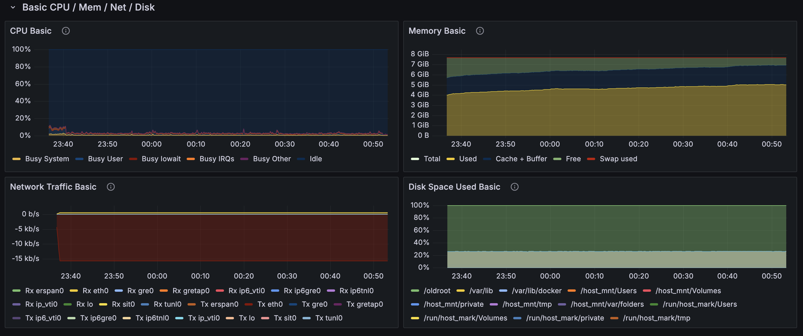
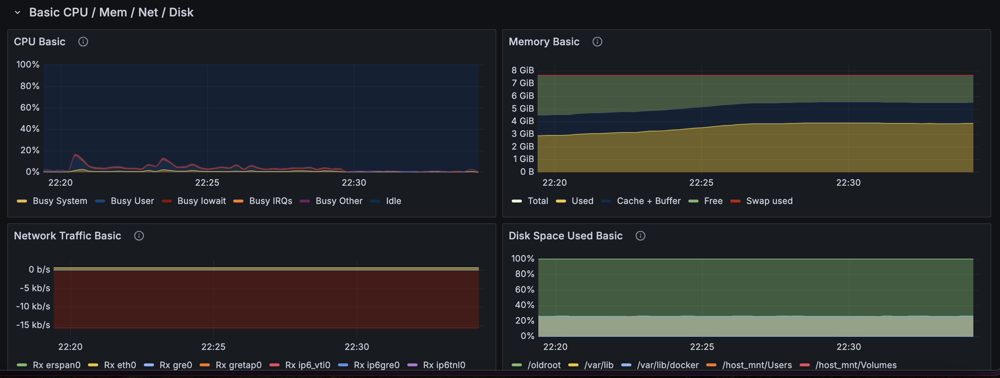

# 장애 대응 보고서 

---
## 성능 테스트 결과
### 쿠폰 발급 - stress test
##### k6 테스트 결과
```shell
         /\      Grafana   /‾‾/  
    /\  /  \     |\  __   /  /   
   /  \/    \    | |/ /  /   ‾‾\ 
  /          \   |   (  |  (‾)  |
 / __________ \  |_|\_\  \_____/ 

     execution: local
        script: issue-coupon-stress.js
        output: -

     scenarios: (100.00%) 1 scenario, 300 max VUs, 4m30s max duration (incl. graceful stop):
              * default: Up to 300 looping VUs for 4m0s over 8 stages (gracefulRampDown: 30s, gracefulStop: 30s)


  █ THRESHOLDS 

    checks
    ✓ 'rate>0.95' rate=99.81%

    http_reqs
    ✓ 'rate>100' rate=672.621304/s


  █ TOTAL RESULTS 

    checks_total.......................: 161433 672.621304/s
    checks_succeeded...................: 99.81% 161133 out of 161433
    checks_failed......................: 0.18%  300 out of 161433

    ✗ 응답 성공
      ↳  99% — ✓ 161133 / ✗ 300

    HTTP
    http_req_duration.......................................................: avg=181.73ms min=1.65ms med=138.6ms  max=2.28s p(90)=388.48ms p(95)=464.83ms
      { expected_response:true }............................................: avg=181.98ms min=2.06ms med=139.05ms max=2.28s p(90)=388.69ms p(95)=464.95ms
    http_req_failed.........................................................: 0.18%  300 out of 161433
    http_reqs...............................................................: 161433 672.621304/s

    EXECUTION
    iteration_duration......................................................: avg=181.93ms min=2.18ms med=138.81ms max=2.28s p(90)=388.72ms p(95)=465.09ms
    iterations..............................................................: 161433 672.621304/s
    vus.....................................................................: 1      min=1             max=300
    vus_max.................................................................: 300    min=300           max=300

    NETWORK
    data_received...........................................................: 47 MB  197 kB/s
    data_sent...............................................................: 30 MB  126 kB/s

```

| 평가 항목         | 결과                     |
|---------------|------------------------|
| **성공률**       | ✅ 99.81% 우수            |
| **응답 속도**     | ✅ p95 < 500ms 매우 빠름    |
| **요청 수(RPS)** | ✅ 672/s 유지             |
| **시스템 안정성**   | ✅ 안정적인 부하 처리 능력        |
| **에러율**       | ✅ 0.18% (300/161433) 정상 범주 |
| **동시성 제어**    | ✅ 쿠폰 재고 정상 및 중복 발급 없음  |

##### monitoring 결과

- Grafana 모니터링 결과
  
  - 메모리 사용량이 최대 90% 가량까지 상승, 다른 리소스는 안정적으로 유지됨
- Kafka 모니터링 결과 
    - Produce
        - 모든 메세지 발행에 약 4분 30초 소요
    - Consume
        - 모든 메세지 소비에 약 1시간 16분 소요

### 쿠폰 발급 - peak test
##### k6 테스트 결과
```shell

         /\      Grafana   /‾‾/  
    /\  /  \     |\  __   /  /   
   /  \/    \    | |/ /  /   ‾‾\ 
  /          \   |   (  |  (‾)  |
 / __________ \  |_|\_\  \_____/ 

     execution: local
        script: issue-coupon-peak.js
        output: -

     scenarios: (100.00%) 1 scenario, 500 max VUs, 1m0s max duration (incl. graceful stop):
              * peak_test: 1000.00 iterations/s for 30s (maxVUs: 200-500, gracefulStop: 30s)


  █ THRESHOLDS 

    checks
    ✓ 'rate>0.95' rate=97.66%
    ✓ 'p(95)<1000' p(95)=960.93ms

    http_reqs
    ✓ 'rate>100' rate=691.133211/s


  █ TOTAL RESULTS 

    checks_total.......................: 21391  691.133211/s
    checks_succeeded...................: 97.66% 20891 out of 21391
    checks_failed......................: 2.33%  500 out of 21391

    ✗ 응답 성공
      ↳  97% — ✓ 20891 / ✗ 500

    HTTP
    http_req_duration.......................................................: avg=697.46ms min=317.72ms med=672.93ms max=1.7s p(90)=857.62ms p(95)=964.1ms 
      { expected_response:true }............................................: avg=695.91ms min=317.72ms med=671.22ms max=1.7s p(90)=842.36ms p(95)=960.93ms
    http_req_failed.........................................................: 2.33%  500 out of 21391
    http_reqs...............................................................: 21391  691.133211/s

    EXECUTION
    dropped_iterations......................................................: 8610   278.185075/s
    iteration_duration......................................................: avg=698.14ms min=318.43ms med=673.27ms max=1.7s p(90)=863.47ms p(95)=964.28ms
    iterations..............................................................: 21391  691.133211/s
    vus.....................................................................: 500    min=403          max=500
    vus_max.................................................................: 500    min=473          max=500

    NETWORK
    data_received...........................................................: 6.2 MB 202 kB/s
    data_sent...............................................................: 4.0 MB 128 kB/s
```

| 평가 항목         | 결과                        |
|---------------|---------------------------|
| **성공률**       | ✅ 97.66% 우수               |
| **응답 속도**     | ✅ p95(960.93ms) < 1000ms 적정       |
| **요청 수(RPS)** | ✅ 691/s 유지                |
| **시스템 안정성**   | ✅ 순간 피크 1000 RPS 이상 처리 가능 |
| **에러율**       | ✅ 2.33% (500/21391) 정상 범주 |
| **동시성 제어**    | ✅ 쿠폰 재고 정상 및 중복 발급 없음     |


##### monitoring 결과

- Grafana 모니터링 결과
    
  - 목표 RPS에 대해 안정적인 리소스 관리가 되는 것으로 확인 

- Kafka 모니터링 결과
    - Produce
        - 모든 메세지 발행에 약 2분 소요
    - Consume
        - 모든 메세지 소비에 약 15분 소요

## 결론 및 개선 사항
### 결론
- **성능 목표 달성**: stress test와 peak test 모두 목표 RPS와 응답 시간 기준을 충족하여 시스템의 안정성과 성능을 입증함.
- **시스템 안정성**: 높은 동시 요청에도 시스템이 안정적으로 작동하며, 쿠폰 재고 관리 및 중복 발급 방지 기능이 정상적으로 작동함.
- **에러율 관리**: 에러율이 모두 허용 범위 내에 있어 시스템의 신뢰성을 확인함.
- **모니터링 결과**: 리소스는 비교적 안정적으로 관리되나, kafka 소비 지연으로 lag이 발생하여 실제 쿠폰 발급 단계에서 비정상적인 Latency 발생.
### 개선 사항
- **Kafka 소비 최적화**: 소비 지연을 줄이기 위해 Kafka Consumer의 처리 속도를 개선할 필요가 있음.