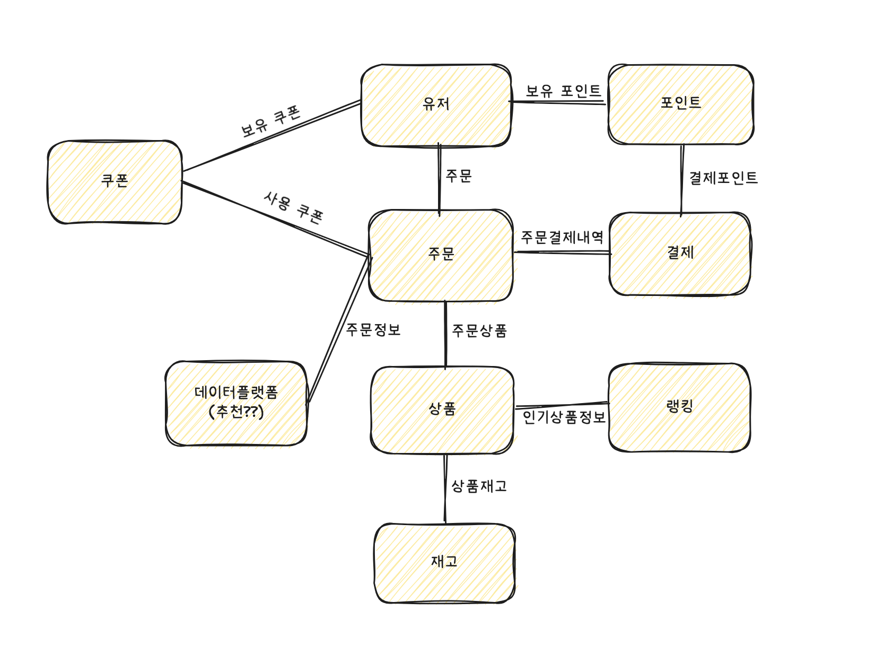
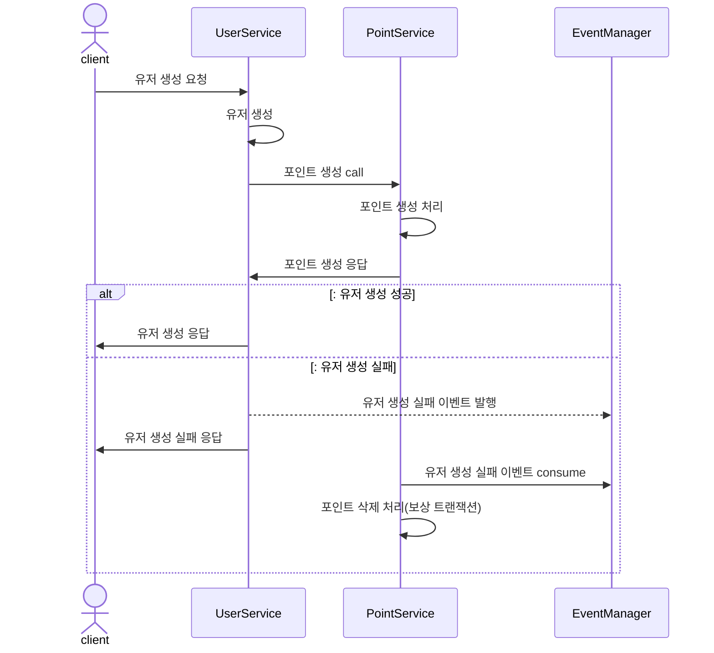
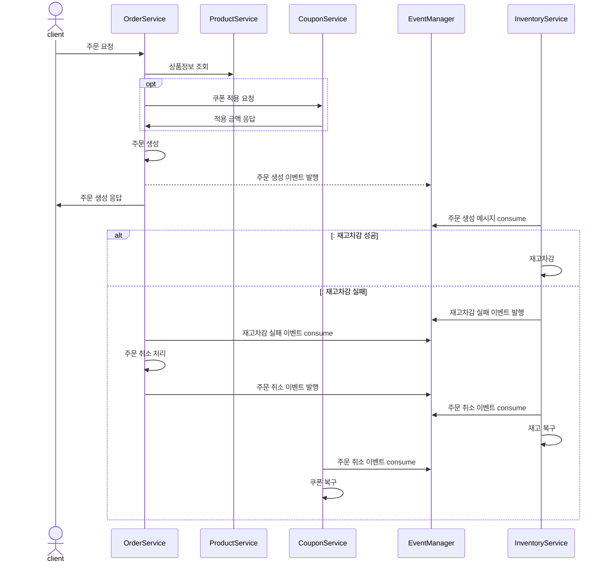
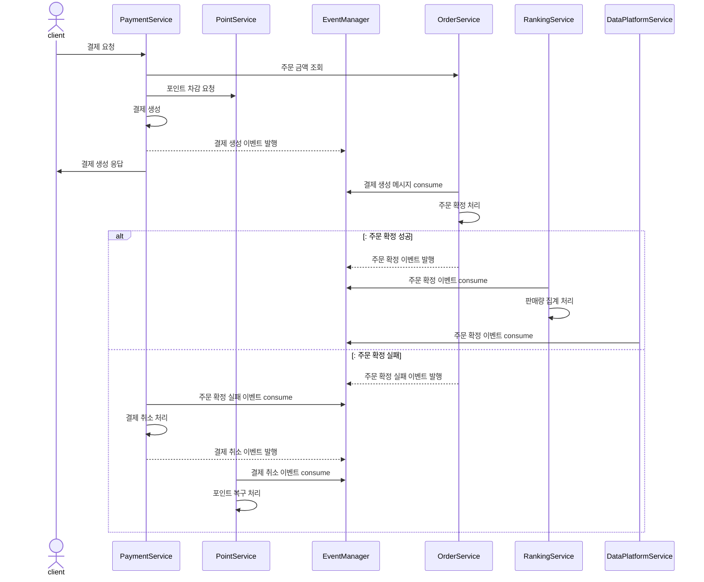

Ecommerce MSA 설계
---
### 1. MSA 설계 개요
- 서비스의 규모 확장에 따라, 각 도메인의 관심사 분리를 통한 유지보수 비용의 절감과 서비스의 유연한 확장을 위해 MSA(Micro Service Architecture)로 전환
- MSA는 각 서비스가 독립적으로 배포되고 운영될 수 있도록 설계된 아키텍처로, 서비스 간의 의존성을 최소화하고, 각 서비스가 독립적으로 개발 및 배포될 수 있도록 지원

##### 도메인 분리

- 유저: 유저의 정보를 관리하는 서비스
  - 유저 정보 : 유저의 기본 정보(이름, 이메일 등)를 관리
- 포인트: 포인트 충전 및 사용을 관리하는 서비스
  - 포인트 사용/충전 트랜잭션 관리
  - 포인트 관련 정책 관리
  - 포인트 사용/충전이력 관리
- 상품: 상품의 정보를 관리하는 서비스
  - 상품 정보(이름, 가격 등)를 관리
- 재고: 재고의 정보를 관리하는 서비스
  - 주문, 주문 취소 등에 따른 상품 재고의 트랜잭션 관리
  - 재고 관련 정책 관리
- 주문: 주문의 정보를 관리하는 서비스
  - 주문 정보(주문 번호, 주문 상품, 주문 상태 등)를 관리
  - 주문 관련 정책 관리
  - 주문 이력 관리
- 결재: 결재의 정보를 관리하는 서비스
  - 결재 정보(결재 번호, 결재 금액, 결재 상태 등)를 관리
  - 결재 관련 정책 관리
  - 결재 이력 관리
- 쿠폰: 쿠폰의 정보를 관리하는 서비스
  - 쿠폰 정보(쿠폰 번호, 쿠폰 종류, 쿠폰 상태 등)를 관리
  - 쿠폰 발급/사용 트랜잭션 관리
  - 쿠폰 관련 정책(발급, 사용, 할인 등) 관리
  - 쿠폰 발급/사용 이력 관리
- 랭킹: 판매량을 기록하고 판매량에 따른 상품의 랭킹 정보를 관리하는 서비스
  - 상품의 판매량 집계
  - 랭킹(상품 순위) 관련 정책(랭킹 기준, 랭킹 기간 등) 관리
- 데이터플랫폼: 데이터 수집 및 분석을 위한 서비스
  - 데이터 수집(로그, 트랜잭션 등)
  - 데이터 분석(판매량, 유저 행동 등)
  - 데이터 시각화(대시보드 등)
---
### 2. 기능별 트랜잭션의 한계 및 해결방안
##### 2-1. 유저

##### 유저 생성
- **한계**: 유저 생성과 포인트 생성의 트랜잭션이 분리되어 있어, 유저 생성 후 포인트 생성이 실패할 경우 유저 정보가 남아있게 됨
- **해결방안**: 유저 생성 트랜잭션에 포인트 생성을 포함
  - 유저 가입 시 포인트 생성은 핵심 로직으로 판단
  - 두 작업 모두 단순 write 작업이므로 하나의 트랜잭션으로 묶어도 성능적 부담이 크지 않다고 판단
  - 유저 생성 실패 시에는 이벤트 발행 -> 포인트 consume 하여 있을 경우 보상 트랜잭션 처리

##### 2-2. 포인트

##### 포인트 충전
- **한계**: 포인트 충전은 다른 도메인과 협력이 필요하지 않으므로 이벤트 및 트랜잭션 분리가 발생하지 않음
- **해결방안**: -

##### 2-3. 상품

##### 상품 조회
- **한계**: 상품 조회는 재고 도메인과 협력하나 조회 기능이므로 이벤트 및 트랜잭션 분리가 발생하지 않음
- **해결방안**: -

##### 2-4. 주문

##### 주문 생성
- **한계**: 주문, 재고, 쿠폰 도메인의 분리로 각 트랜잭션이 분리되어 주문생성 후 재고 차감 또는 쿠폰 사용에 실패하는 경우 데이터 정합성이 깨질 우려가 있음
- **해결방안**: 주문 생성과 쿠폰 사용은 하나의 트랜잭션으로 묶어 처리, 주문 생성 이벤트를 발행하면 재고 도메인에서 consume 하여 재고 차감 처리 실패시 재고 차감 실패 이벤트 -> 주문 취소 -> 주문 취소 이벤트 발행 -> 쿠폰, 재고에서 consume하여 각각 처리 
  - 주문 -> 재고 차감, 쿠폰 사용은 핵심로직이며 각 작업은 read-write 이므로 성능적 부담이 큼
  - 그러나 쿠폰 사용은 주문 금액 계산을 위해 필요하므로 주문 생성과 함께 처리
  - 재고 차감은 주문 생성 후 처리 가능하므로 재고 도메인에서 주문 생성 이벤트를 consume 하여 처리
  - 주문 생성 후 재고 차감에 실패하여 취소처리 되는 경우 알림 등으로 유저에게 통지

##### 2-5. 결재

##### 결재 요청
- **한계**: 결재 요청 시 포인트 차감, 주문 확정, 랭킹 판매량 집계, 데이터플랫폼 전송이 필요하나, 각 트랜잭션이 분리되어 정합성이 깨질 수 있음
- **해결방안**: 결제 생성 트랜잭션에 포인트 차감을 포함하며, 결재 생성 이벤트를 발행하고 주문이 consume 하여 주문 확정 처리, 주문확정 이벤트를 발행하고 이를 랭킹과 데이터플랫폼에서 consume 하여 랭킹 판매량 집계, 데이터 플랫폼 전송을 처리
  - 포인트 차감, 주문 확정은 핵심로직이나, 각 작업은 read-write 이므로 성능적 부담이 큼
  - 포인트 차감은 금전과 관련된 도메인으로 중요도가 높다고 판단하여 결제 요청과 함께 처리
  - 주문 확정은 결재 요청 후 처리 가능하므로 주문 도메인에서 결재 요청 이벤트를 consume 하여 처리
  - 주문 확정 실패시 주문 확정 실패 이벤트를 발행하여 결제 취소(보상 트랜잭션) 처리 및 결제 취소 이벤트 발행하여 포인트 복구(보상 트랜잭션) 처리
  - 결재 요청 후 주문 확정에 실패하여 취소처리 되는 경우 알림 등으로 유저에게 통지
  - 랭킹 판매량 집계와 데이터 플랫폼 전송은 부가 로직으로 판단하여 실패하더라도 결제는 실패하지 않으며, 실패 내역은 로깅 등을 통해 추후 처리

##### 2-6. 쿠폰

##### 쿠폰 발급
- **한계**: 쿠폰 발급은 다른 도메인과 협력없이 쿠폰 도메인 내에서 처리되므로 이벤트 및 트랜잭션 분리가 발생하지 않음
- **해결방안**: -

##### 보유 쿠폰 조회
- **한계**: 보유 쿠폰 조회는 다른 도메인과 협력없이 쿠폰 도메인 내에서 처리되므로 이벤트 및 트랜잭션 분리가 발생하지 않음
- **해결방안**: -

##### 2-7. 랭킹
##### 인기상품 조회
- **한계**: 인기상품 조회는 상품, 재고 도메인과 협력이 필요하나 조회 기능이므로 이벤트 및 트랜잭션 분리가 발생하지 않음
- **해결방안**: -
