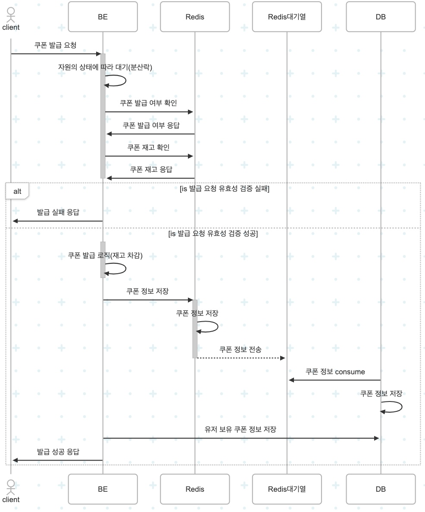
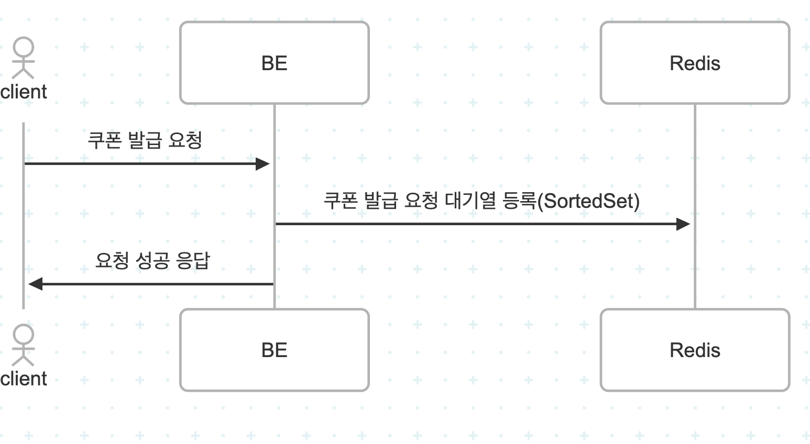
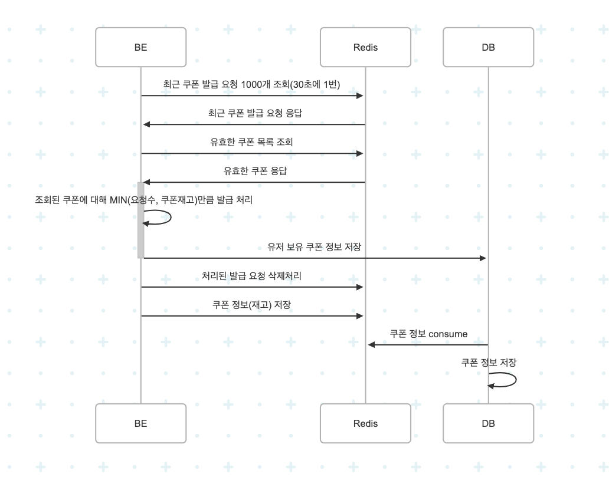

# Redis 적용 보고서

## 배경

동시성은 보장되나, 가용성과 대용량 트래픽에서 DB 부하가 존재하는 기존 분산락 + RDB 기반 아키텍처의 한계를 극복하기 위해 Redis를 기반으로 대용량 트래픽이 예상되는 쿠폰 발급 기능을 재설계하였다.   

## 대상 선정 이유

### 선착순 쿠폰 발급

기존 선착순 쿠폰 발급은 RDB의 비관적 락(Pessimistic Lock)과 Redis의 분산 락을 통해 동시성 이슈를 제어하였으나, 락 충돌, 대기 시간 증가, 성능 저하 등의 문제를 유발할 수 있으며, 락 관리에 대한 복잡성 또한 높아진다.

대기열을 구현하여 동시성 문제를 해결하며, Redis를 적용하여 쿠폰 재고의 조회, 발급 여부 조회 등에 네트워크 비용을 감소시킴으로써 성능을 향상시킬 수 있다.

## 설계

### 1. Redis를 활용한 선착순 쿠폰 발급 로직

### 2. 동시성 제어를 위한 Redis 대기열
- 요청 등록

- 요청 처리 스케줄러
