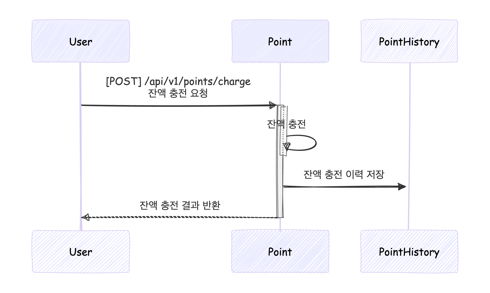
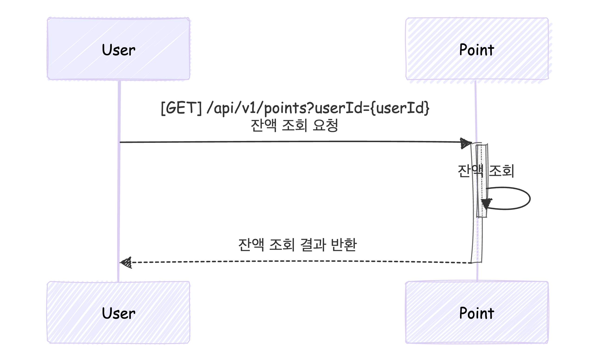
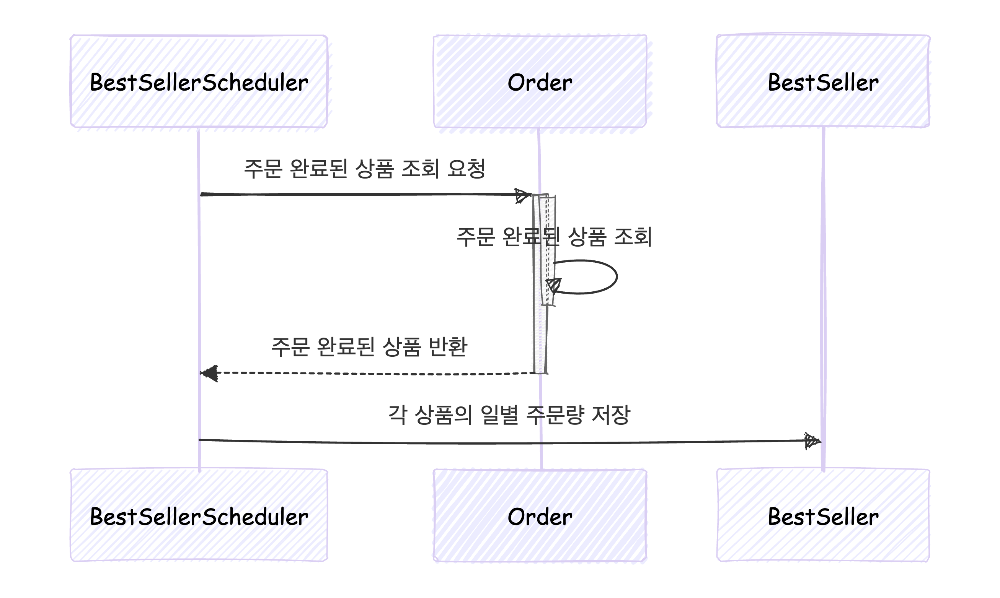
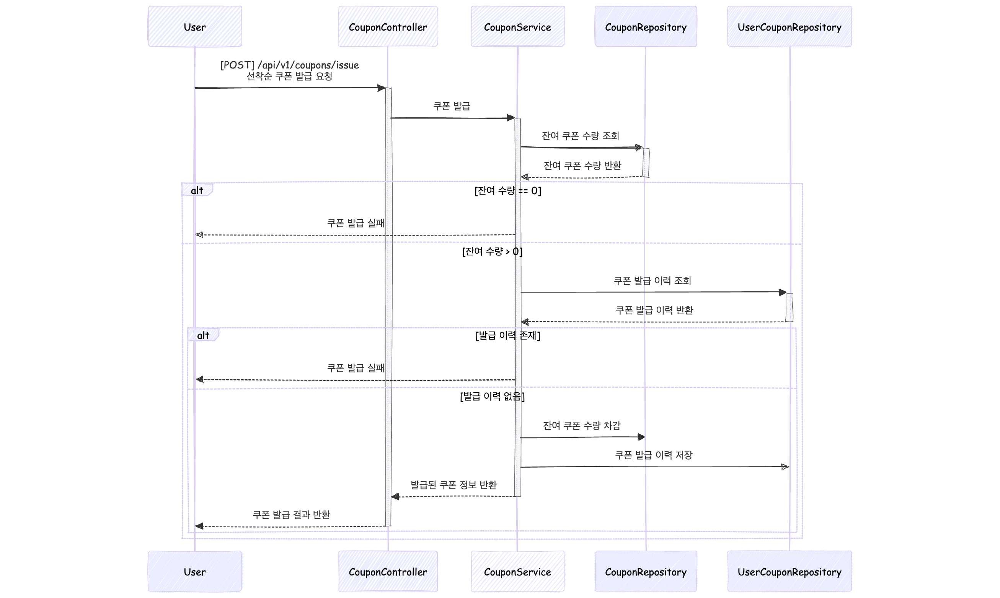
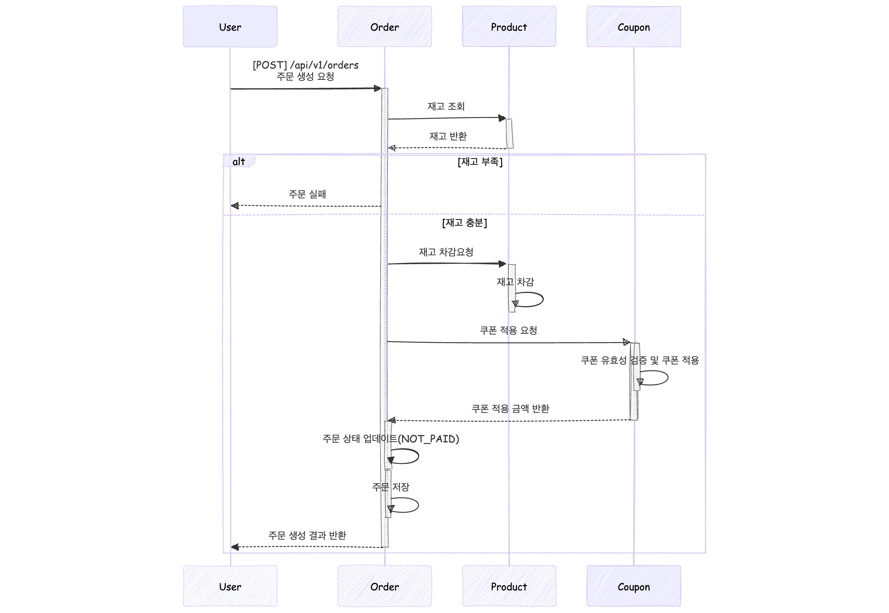
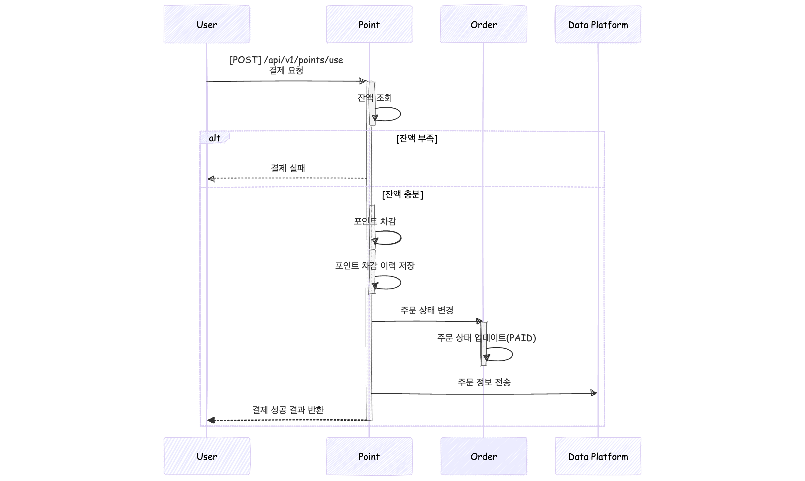

### Sequence Diagram

#### 포인트
1. 포인트 충전
  

2. 포인트 잔액 조회
  

#### 상품
1. 상품 목록 조회
  

#### 인기상품
1. 인기상품 조회
  
2. 인기상품 통계 배치
  

#### 쿠폰
1. 쿠폰 발급
  
2. 보유 쿠폰 조회
    

#### 주문
1. 주문 생성
  
2. 5분간 미결제시 주문 취소
  

#### 결제
1. 결제
  